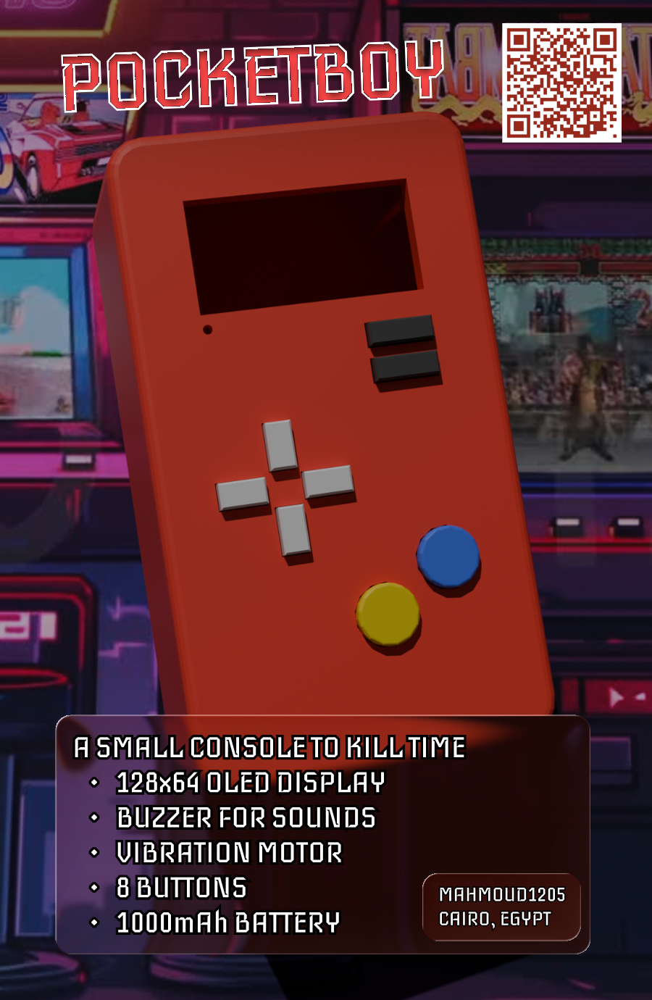
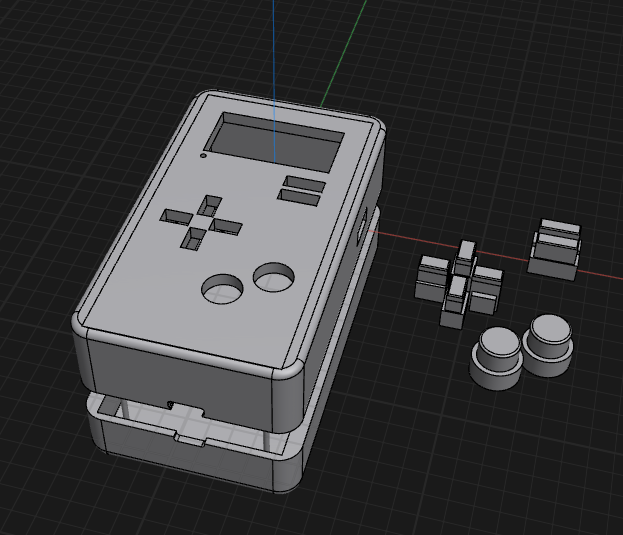
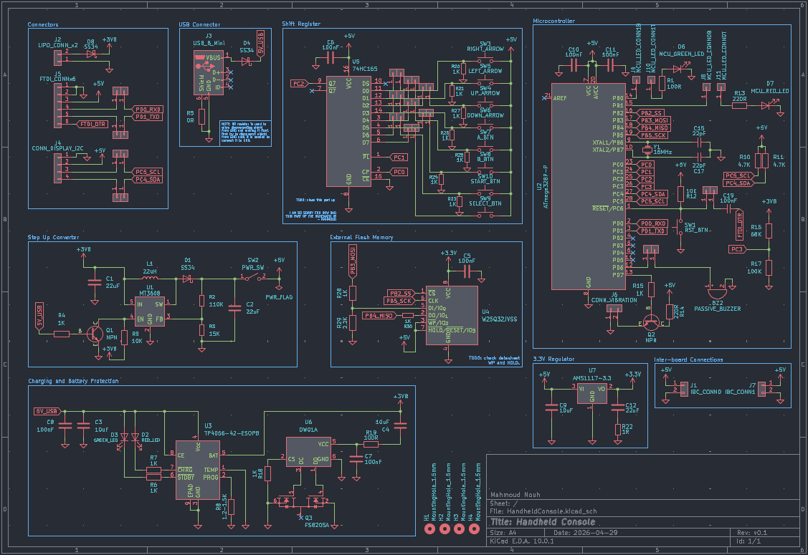
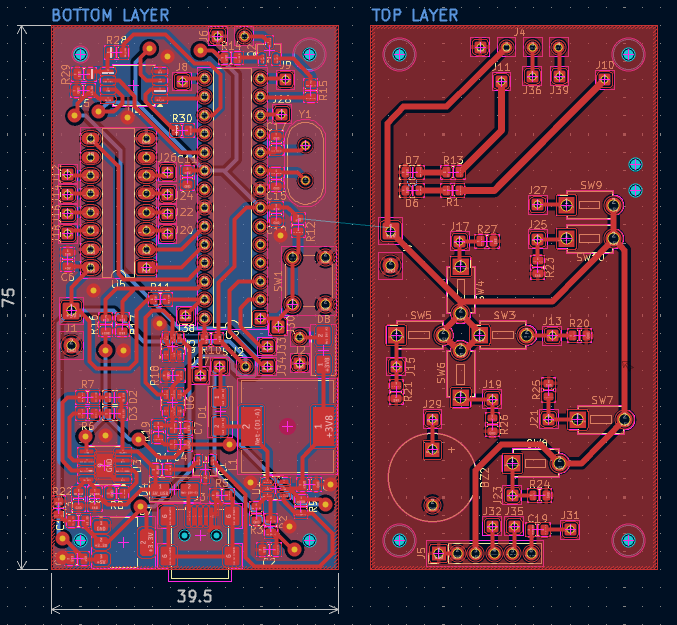

# PocketBoy

The PocketBoy is a small handheld console made completely from scratch with a custom PCB and enclosure. The PocketBoy is small enough to fit in a pocket but has a 1000mAh battery for long gaming sessions. The PocketBoy has 8 buttons and a 128x64 monochrome OLED display, it also has a buzzer and a vibration motor.

Design files can be found in `/Design/Hardware`.

Some prototype code can be found in `/Design/Software`.

