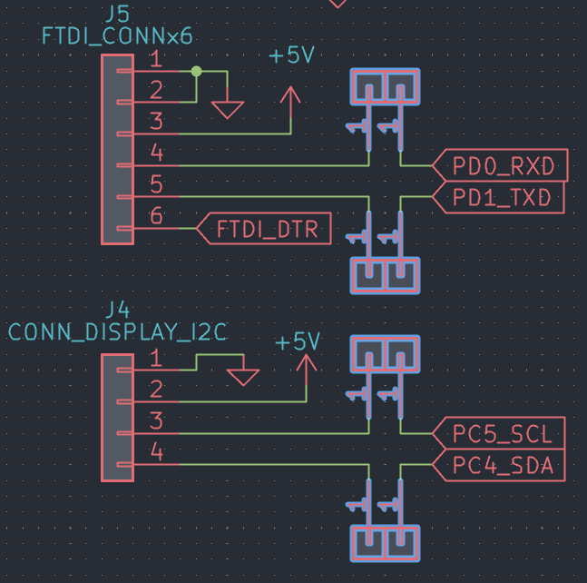

# PocketBoy

The PocketBoy is a small handheld console made completely from scratch with a custom PCB and enclosure. The PocketBoy is small enough to fit in a pocket but has a 1000mAh battery for long gaming sessions. The PocketBoy has 8 buttons and a 128x64 monochrome OLED display, it also has a buzzer and a vibration motor.

The PocketBoy is made so you can kill time offline anywhere you are. It is very small (approximately 8x5cm) to easily fit in a pocket and has a strong battery which can be easily replaced. It also has a passive buzzer and vibration motor for extra immersion.

## How to use the PocketBoy

## Fabrication and Assembly Info
- Design files can be found in `/Design/Hardware`.
- Some prototype code can be found in `/Design/Software`. More software will be added in the future.
- M2x20mm screws are used to hold the two enclosure parts together. Please thread them manually after printing the enclosure.
- Please ensure to solder the USB connector accurately so it can fit in the enclosure.
- Please print the design so that the two enclosure parts and all of the buttons are separate from each other.
- The PCB is split into two PCBs, they are connected together using wires after printing both of them. The board connection wires are drawn in the schematic as two 01x01 connectors placed next to each other as in the image below. 
- When soldering the power switch on the bottom PCB, please make sure that its wires come out of the top PCB so the switch can be placed in its position securely.
- After all parts are fabricated, you assemble the console this way: first place the battery at the bottom of the enclosure, then place the bottom PCB above the battery, it should float above the battery because the USB connecter will raise it. Then put the power switch in its hole and secure it in its place. Then place the buttons on the top part of the enclosure and then align the top PCB to be placed above the bottom PCB with a distance enough to keep the buttons stable above the top PCB. Then put the display in the display hole on the top part of the enclosure. Then place both parts of the enclosure on top of each other and hold them together using M2x20mm screws.
- The board can be programmed using an FTDI connector on the top PCB.

## Notes for Fallout reviewers.
As of now there is only a very simple FlappyBird game but I will make more games when the console is built.

